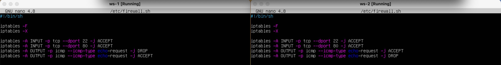
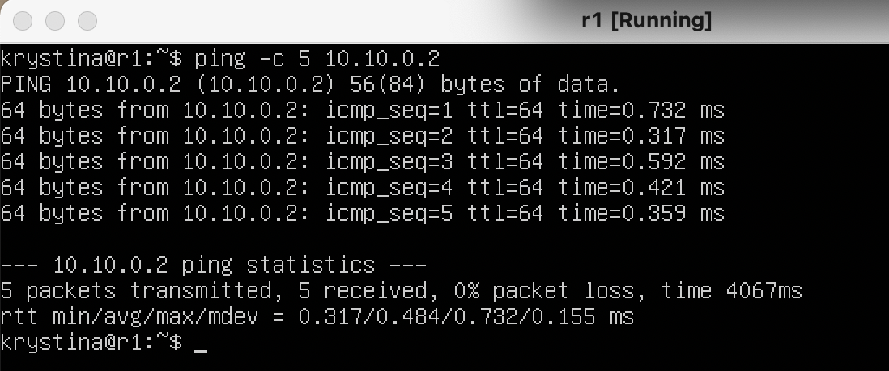

# Сети в Linux

Настройка сетей в Linux на виртуальных машинах.

## Part 1. Инструмент **ipcalc**

##### Поднял виртуальную машину (далее -- ws-1).

Рис.1 Установленная ОС

#### 1.1. Сети и маски

##### Определил и записал в отчёт:

##### 1) адрес сети *192.167.38.54/13*

Рис.2 Применение утилиты ipcalc с 192.167.38.54/13

- Адрес сети 192.167.38.54/13 - 192.167.38.54

##### 2) перевод маски *255.255.255.0* в префиксную и двоичную запись, */15* в обычную и двоичную, *11111111.11111111.11111111.11110000* в обычную и префиксную

Рис.3 Применение утилиты ipcalc с 255.255.255.0

1. Перевод 255.255.255.0:

    - Префиксная запись  - /24

    - Двоичная запись - 11111111.11111111.11111111. 000000000

Рис.4 Применение утилиты ipcalc с /15

2. Перевод /15:

    - Обычная запись - 255.254.0.0

    - Двоичная запись - 11111111.11111110.00000000. 000000000

3. Перевод 11111111.11111111.11111111.11110000: 

    - Обычная запись - 255.255.255.240

    - Префиксная запись - /28

##### 3) минимальный и максимальный хост в сети *12.167.38.4* при масках: */8*, *11111111.11111111.00000000.00000000*, *255.255.254.0* и */4*

Рис. 5 Применение утилиты ipcalc с 12.167.38.4/8

1. Сеть 12.167.38.4/8:

    - Минимальный хост 12.0.0.1

    - Максимальный хост 12.255.255.254

Рис. 6 Применение утилиты ipcalc с 12.167.38.4/11111111.11111111.00000000.00000000 (она же 12.167.38.4/16)

2. Сеть 12.167.38.4/11111111.11111111.00000000.00000000 (она же 12.167.38.4/16):

    - Минимальный хост 12.167.0.1

    - Максимальный хост 12.167.255.254

Рис. 7 Применение утилиты ipcalc с 12.167.38.4/255.255.254.0

3. Сеть 12.167.38.4/255.255.254.0:

    - Минимальный хост 12.167.38.1

    - Максимальный хост 12.167.39.254

Рис. 8 Применение утилиты ipcalc с 12.167.38.4/4

4. Сеть 12.167.38.4/4:

    - Минимальный хост 0.0.0.1

    - Максимальный хост 15.255.255.254

#### 1.2. localhost

##### Определил и записал в отчёт можно ли обратиться к приложению, работающему на localhost, со следующими IP: 194.34.23.100, 127.0.0.2, 127.1.0.1, 128.0.0.1

##### Можно обратиться к приложению, работающему на localhost, с IP: 127.0.0.2, 127.1.0.1, так как localhost (так называемый, «местный» от англ. local, или «локальный хост», по смыслу — этот компьютер) — в компьютерных сетях, стандартное, официально зарезервированное доменное имя для частных IP-адресов (в диапазоне 127.0.0.1 — 127.255.255.254), а значит IP 194.34.23.100 и 128.0.0.1 не подходят для обращений.

#### 1.3. Диапазоны и сегменты сетей

##### Определил и записал в отчёт: 

##### 1) какие из перечисленных IP можно использовать в качестве публичного, а какие только в качестве частных: 

- Частные: 10.0.0.45, 10.10.10.10, 192.168.4.2, 172.20.250.4, 172.16.255.255.

- Публичные: 134.43.0.2, 172.0.2.1, 192.172.0.1, 192.169.168.1, 172.68.0.2.

##### 2) какие из перечисленных IP адресов шлюза возможны у сети 10.10.0.0/18: 

Рис. 9 Применение утилиты ipcalc с 10.10.0.0/18

##### Согласно результатам выдачи, доступны адреса: 10.10.0.2, 10.10.10.10, 10.10.1.255

## Part 2. Статическая маршрутизация между двумя машинами

##### Поднял вторую виртуальную машину (далее -- ws-2).

Рис. 10 Установленная ОС на второй ВМ

##### С помощью команды ip a посмотрел существующие сетевые интерфейсы

##### ws-1:

Рис. 11 Вызов и вывод команды ip a на ws-1

##### ws-2:

Рис. 12 Вызов и вывод команды ip a на ws-2

##### Описал сетевой интерфейс, соответствующий внутренней сети, на обеих машинах и задал следующие адреса и маски: ws1 - 192.168.100.10, маска /16, ws2 - 172.24.116.8, маска /12

##### ws-1:

Рис. 13 Измененный файл /etc/netplan/00-installer-config.yaml на ws-1

##### ws-2:

Рис. 14 Измененный файл /etc/netplan/00-installer-config.yaml на ws-2

##### Выполнил команду netplan apply для перезапуска сервиса сети

Рис. 15 Команда для перезапуска сервиса сети и проверка внесенных изменений на ws-1

Рис. 16 Команда для перезапуска сервиса сети и проверка внесенных изменений на ws-2

#### 2.1. Добавление статического маршрута вручную

##### Добавил статический маршрут от одной машины до другой и обратно при помощи команды вида ip r add

##### Маршрут от ws-1 до ws-2

Рис. 17 Маршрут от ws-1 до ws-2 с использованием команды ip r add

##### Маршрут от ws-2 до ws-1

Рис. 17 Маршрут от ws-2 до ws-1 с использованием команды ip r add

##### Пропинговал соединение между машинами

Рис. 18 Пинг соединения с ws-2 на ws-1

Рис. 18 Пинг соединения с ws-1 на ws-2

#### 2.2. Добавление статического маршрута с сохранением

##### Перезапустил машины, маршруты не сохранились

Рис. 19 Применение команды ip r на ws-1

Рис. 20 Применение команды ip r на ws-2

##### Добавил статический маршрут от одной машины до другой с помощью файла etc/netplan/00-installer-config.yaml

Рис. 21 Cодержание изменённого файла etc/netplan/00-installer-config.yaml на ws-1

Рис. 22 Cодержание изменённого файла etc/netplan/00-installer-config.yaml на ws-2

##### Пропинговал соединение между машинами

Рис. 23 Пинг соединения с ws-2 на ws-1

Рис. 24 Пинг соединения с ws-1 на ws-2

## Part 3. Утилита iperf3

#### 3.1. Скорость соединения

##### Перевел и записал в отчет: 8 Mbps в MB/s, 100 MB/s в Kbps, 1 Gbps в Mbps

8 Mbps = 1 MB/s;

100 MB/s = 800000 Kbps;

1 Gbps = 1000 Mbps.

#### 3.2. Утилита iperf3

##### Измерил скорость соединения между ws1 и ws2

Рис. 25 Измерение скорости соединения между машины с помощью утилиты iperf3

## Part 4. Сетевой экран

#### 4.1. Утилита iptables

##### Создал файл /etc/firewall.sh, имитирующий фаерволл, на ws1 и ws2. Добавил в файл подряд следующие правила:

1) на ws1 применил стратегию когда в начале пишется запрещающее правило, а в конце пишется разрешающее правило (это касается пунктов 4 и 5)

2) на ws2 применил стратегию когда в начале пишется разрешающее правило, а в конце пишется запрещающее правило (это касается пунктов 4 и 5)

3) открыл на машинах доступ для порта 22 (ssh) и порта 80 (http)

4) запретил echo reply (машина не должна "пинговаться”, т.е. должна быть блокировка на OUTPUT)

5) разрешил echo reply (машина должна "пинговаться")

Рис. 26 Файлы /etc/firewall.sh на обеих машинах

##### Запустил файлы на обеих машинах командами chmod +x /etc/firewall.sh и /etc/firewall.sh

Рис. 27 Запуск файлов на обоих машинах

##### Разница между стратегиями заключается в том, что из-за последовательного (сверху вниз) выполнения команд в первом файле пинговка между машинами не случится, а во втором - случится

#### 4.2. Утилита nmap

##### Командой ping нашёл машину, которая не "пингуется". Машина ws-1

Рис. 28 Ввод команд ping на обеих машинах

##### Утилитой nmap показал, что хост машины запущен

##### ws-1: 

Рис. 29 Ввод команды nmap на машине ws-1

##### ws-2:

Рис. 30 Ввод команды nmap на машине ws-2

##### Сохранил дампы образов виртуальных машин

Рис. 31 Сохранённые дампы

## Part 5. Статическая маршрутизация сети

##### Поднял пять виртуальных машин (3 рабочие станции (ws11, ws21, ws22) и 2 роутера (r1, r2))

Рис. 32 Пять ВМ В VirtualBox

#### 5.1. Настройка адресов машин

##### Настроил конфигурации машин в etc/netplan/00-installer-config.yaml согласно сети на рисунке.

Рис. 33 Сеть ВМ

##### ws11:

Рис. 34 Конфиг на ws11

##### ws21:

Рис. 35 Конфиг на ws21

##### ws22:

Рис. 36 Конфиг на ws22

##### r1:

Рис. 37 Конфиг на r1

##### r2:

Рис. 38 Конфиг на r2

##### Перезапустил сервис сети. Командой ip -4 a проверить, что адрес машины задан верно. 

##### ws11:

Рис. 39 Проверка адреса ws11

##### ws21:

Рис. 40 Проверка адреса ws21

##### ws22:

Рис. 41 Проверка адреса ws22

##### r1:

Рис. 42 Проверка адреса r1

##### r2:

Рис. 43 Проверка адреса r2

##### Пропинговал ws22 с ws21. 

Рис. 44 Пинг ws22 с ws21

##### Аналогично пропинговал r1 с ws11.

Рис. 45 Пинг r1 с ws11

#### 5.2. Настройка адресов машин

##### Выполнил команду sysctl -w net.ipv4.ip_forward=1 на роутерах

Рис. 46 Выполнение команды на роутерах

##### Открыл файл /etc/sysctl.conf и добавил в него строку net.ipv4.ip_forward = 1

Рис. 47 Редактирование файла на роутерах

#### 5.3. Установка маршрута по-умолчанию

##### Настроил маршрут по-умолчанию (шлюз) для рабочих станций. Для этого добавил default перед IP роутера в файле конфигураций

Рис. 48 Редактирование конфигов рабочих станций

##### Вызвал ip r и показал, что добавился маршрут в таблицу маршрутизации

Рис. 49 Вызов команды ip r на всех рабочих станциях

##### Пропинговал с ws11 роутер r2 и показал на r2, что пинг доходит. Для этого использовал команду tcpdump -tn -i eth1

Рис. 50 Пинг с ws11 и проверка на r2

#### 5.4. Добавление статических маршрутов

##### Добавил в роутеры r1 и r2 статические маршруты в файле конфигураций.

Рис. 51 Добавленные маршруты в r1 и r2

##### Вызвал ip r и показал таблицы с маршрутами на обоих роутерах.

Рис. 52 Вызов команды ip r

##### Запустил ip r list 10.10.0.0/[маска сети] и ip r list 0.0.0.0/0 на ws11:

Рис. 53 Вызов команд на ws11

##### Для адреса 10.10.0.0/18 был выбран маршрут, отличный от 0.0.0.0/0 (он попадает под маршрут по-умолчанию), т.к. машина ws11 соединена с сетью 10.10.0.0/18 по своему IP-адресу 10.10.0.2, для других адресов используется маршрут по умолчанию, который указан в файле 10.10.0.1.

#### 5.5. Построение списка маршрутизаторов

Рис. 54 Вызов утилиты traceroute и команды дампа

##### Команда traceroute linux использует UDP пакеты. Она отправляет пакет с TTL=1 и смотрит адрес ответившего узла, дальше TTL=2, TTL=3 и так пока не достигнет цели. Каждый раз отправляется по три пакета и для каждого из них измеряется время прохождения. Пакет отправляется на случайный порт, который, скорее всего, не занят. Когда утилита traceroute получает сообщение от целевого узла о том, что порт недоступен трассировка считается завершенной.

#### 5.6. Использование протокола ICMP при маршрутизации

Рис. 54 Вызов и вывод использованных команд с протоколом icmp

##### Сохранил дампы образов машин

Рис. 55 Дампы виртуальных машин

## Part 6. Динамическая настройка IP с помощью DHCP

##### Для r2 настроил в файле /etc/dhcp/dhcpd.conf конфигурацию службы DHCP:

1. Указал адрес маршрутизатора по-умолчанию, DNS-сервер и адрес внутренней сети.

Рис. 56 Измененный конфиг DHCP

2. В файле resolv.conf прописал nameserver 8.8.8.8.

Рис. 57 Измененный конфиг resolv

##### Перезагрузил службу DHCP командой systemctl restart isc-dhcp-server.

Рис. 58 Перезагрузка DHCP

##### После перзагрузки ws21 получила новый динамический IP. (Предварительно отредактировал конфиг)

Рис. 59 Вызов команды ip a для проверки нового адреса

##### Пропинговал ws22 с ws21

Рис. 60 Пинг ws22 c ws21

##### Указал MAC адрес у ws11, для этого в etc/netplan/00-installer-config.yaml добавил строки: "macaddress: 10:10:10:10:10:BA", "dhcp4: true"

Рис. 61 Изменённый конфиг

##### Для r2 настроил в файле /etc/dhcp/dhcpd.conf конфигурацию службы DHCP:

Рис. 61 Конфиг службы DHCP

##### В файле resolv.conf прописал nameserver

Рис. 62 Изменённый конфиг

##### Запросил с ws21 обновление ip адреса

Рис. 64 Адрес до DHCP 

Рис. 65 Рестарт DHCP

Рис. 66 Адрес после DHCP

##### Использовал клиент протокола динамической конфигурации хоста (команда dhclient) для обновления и освобождения IP-адреса

Рис. 67 Дампы

## Part 7. NAT

##### Cделал сервер Apache2 общедоступным

Рис. 68 Конфиг Apache2

##### Запустил веб-сервер Apache командой service apache2 start на ws22 и r1

Рис. 69 Запуск сервера Apache

##### Создал фаервол по аналогии с фаерволом из Части 4 по следующим правилам: 

1. Удаление правил в таблице filter - iptables -F

2. Удаление правил в таблице "NAT" - iptables -F -t nat

3. Отбрасывать все маршрутизируемые пакеты - iptables --policy FORWARD DROP

Рис. 70 Фаервол на r2

Рис. 71 Запуск файла на r2

Рис. 72 Соединение между ws22 и r1 отсутствует

##### Добавил ещё одно правило. 

4. Разрешить маршрутизацию всех пакетов протокола ICMP, для этого прописать правило для протокола icmp и цепочки FORWARD

Рис. 73 Код обновленного скрипта

Рис. 74 Запуск скрипта

##### Проверил, пингуются ли машины с обновленным скриптом

Рис. 75 Машины пингуются

##### Добавил ещё два правила

5. Включить SNAT, а именно маскирование всех локальных ip из локальной сети, находящейся за r2 

6. Включить DNAT на 8080 порт машины r2 и добавить к веб-серверу Apache, запущенному на ws22, доступ извне сети

Рис. 76 Добавил новые правила для SNAT и DNAT

##### Проверил соединение по TCP для SNAT

Рис. 77 Соединение с сервером на r1 с ws22

##### Проверил соединение по TCP для DNAT

Рис. 78 Соединение с сервером на ws22 с r1

##### Сохранил дампы образов виртуальных машин

Рис. 79 Дампы

## Part8. Знакомство с SSH Tunnels

##### Запустил на r2 фаервол с правилами из Части 7

Рис. 80 Код фаервола

Рис. 81 Запуск Фаервола

##### Запустил веб-сервер Apache на ws22 только на localhost

Рис. 82 Код конфига портов Apache

##### Воспользовался Local TCP forwarding с ws21 до ws22, чтобы получить доступ к веб-серверу на ws22 с ws21

Рис. 83 Создал соединение SSH

Рис. 84 Ввод команды

Рис. 85 Результат выполнения команды

Рис. 86 Запуск утилиты telnet на ws21

##### Воспользовался Remote TCP forwarding c ws11 до ws22, чтобы получить доступ к веб-серверу на ws22 с ws11

Рис. 87 Соединение c r2 

Рис. 88 Соединение с ws22 из ws11 через r2(ввод команды ssh 10.20.0.20 не влез, но на скриншоте видны остальные следы)

Рис. 89 Применение Remote после предыдущего этапа

Рис. 90 Проверка соединения

##### Сохранил дампы

Рис. 91 Дампы